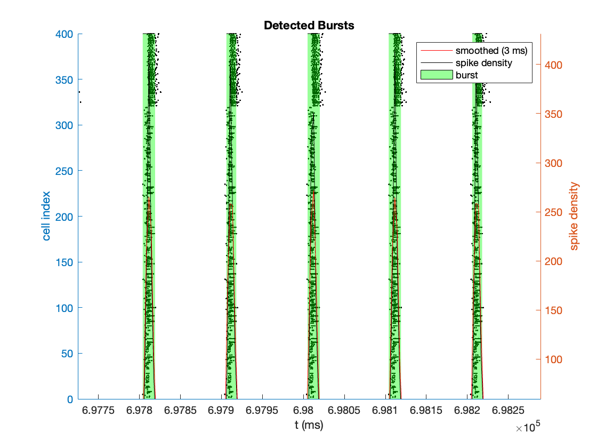
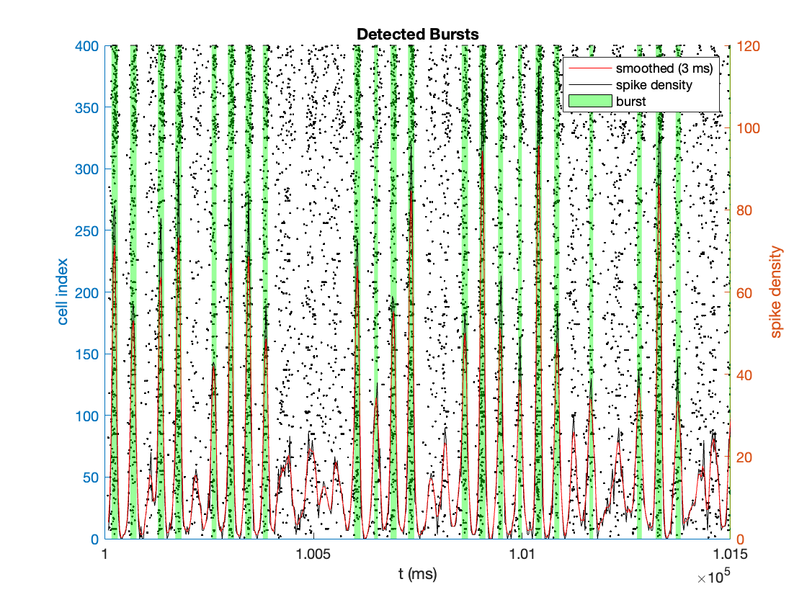
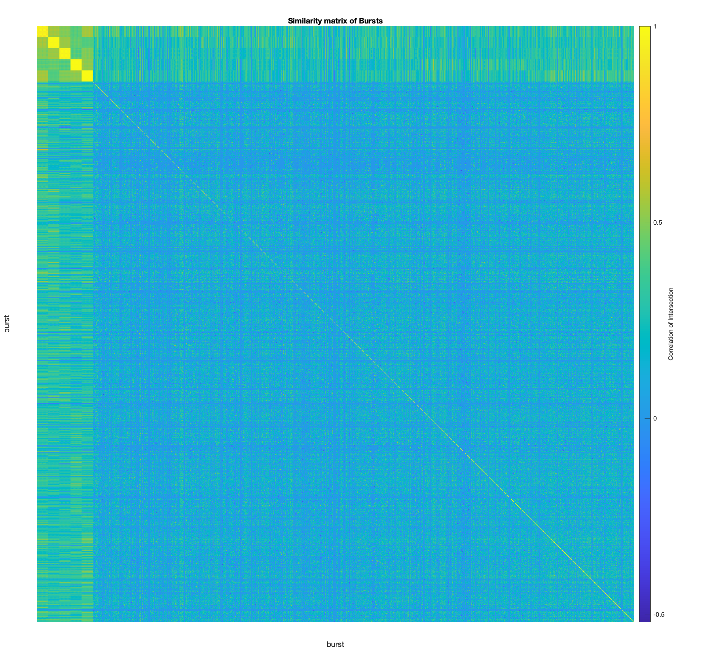
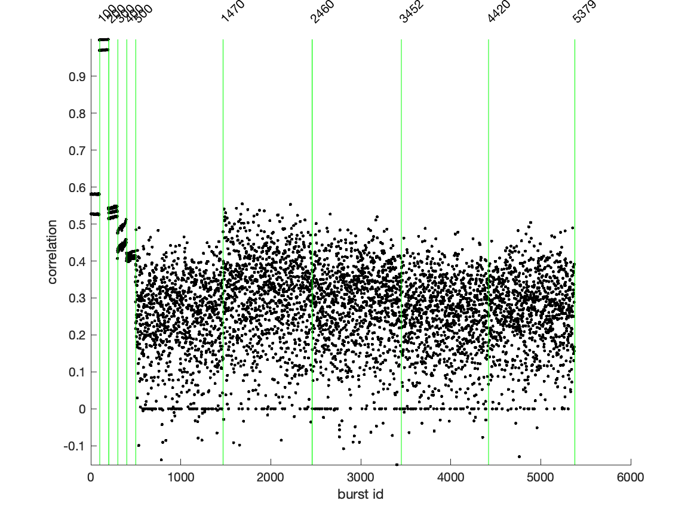
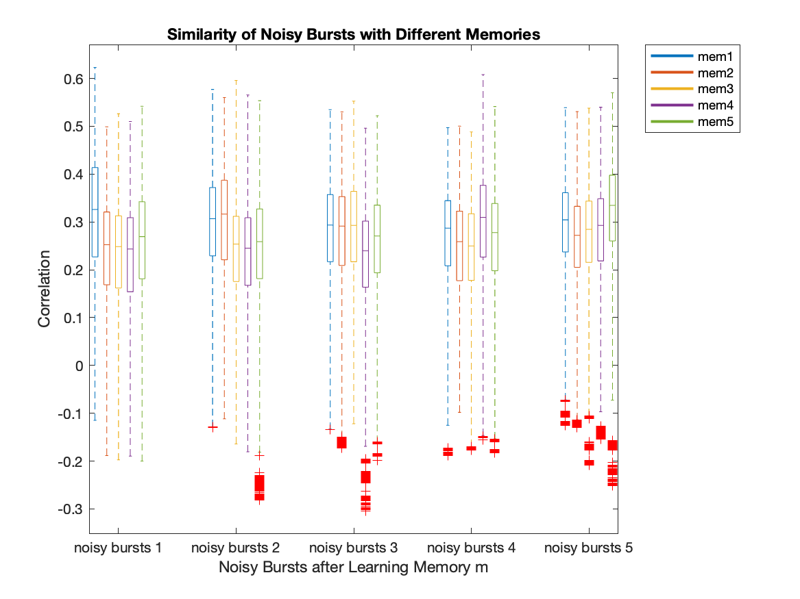

### Research Question
**Can we develop a consolidation mechanism for sequential learning to prevent catastrophic forgetting?**

**Initial Approach:** Explore if stochastic noise can automatically activate previously learned memories.

