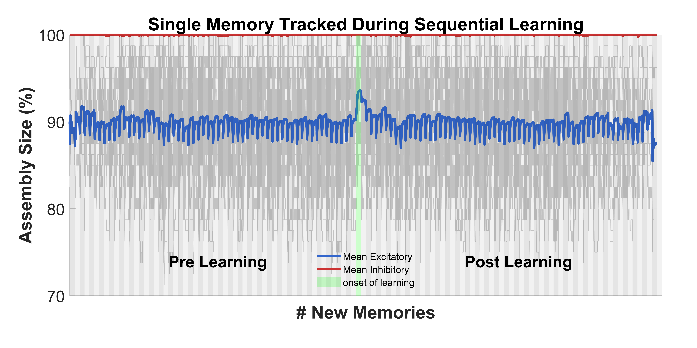

# PartX: [Short Title of This Part]

## Description
Briefly describe what this part does in 2–3 sentences.

## Directory Structure
- **Data/**: [Explain what kind of data is stored here.]
- **Results/**: [Mention the output files or plots saved here.]
- **Step1_ScriptName.m**: [Explain the purpose of the first step.]
- **Step2_ScriptName.m**: ...
- **...**

## Execution Order
1. `Step1_ScriptName.m` – [What it does]
2. `Step2_ScriptName.m` – [What it does]
3. ...

## Main Results

## Notes
- Any specific settings, dependencies, or expected input formats.
- Any assumptions or critical points to check before running.

